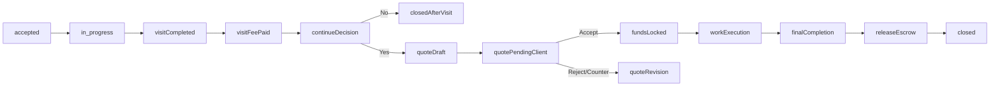

# Phase 2 Appointment + Escrow Implementation Plan

## Scope Baseline
- Use the current production flow as baseline (negotiation -> accepted -> in_progress -> handyman_done -> awaiting_payment -> paid -> closed).
- Preserve all existing behavior that already works in this branch.
- Add a new branch in the lifecycle after initial visit handling so jobs can continue through a quote + escrow path.

## Equal Split (50/50)
- We split work into 10 implementation tasks (5 each), balanced by backend/frontend effort.
- I will implement **My Tasks** first, one by one, and mark each done before moving to the next.
- Your colleague will continue tomorrow with **Colleague Tasks** that remain unchecked.

### My Tasks (to implement now)
- [x] M1: Backend domain models + migrations (`Quote`, `QuoteLineItem`, `EscrowHold`, wallet lock fields, booking state fields).
- [x] M2: Backend transactional escrow service (lock/unlock/release/refund with atomic updates).
- [x] M3: Backend booking/quote/escrow APIs + URL wiring + serializer exposure.
- [x] M4: Frontend type updates + quote/escrow API client calls.
- [x] M5: Frontend booking detail flow (`Continue the Job`, quote review/accept, escrow lock indicators).

### Colleague Tasks (tomorrow)
- [ ] C1: Admin backend APIs for Tracking/Verification/Services/Finances.
- [ ] C2: Admin frontend pages for Tracking/Verification/Services/Finances.
- [ ] C3: Wallet UI improvements in header/profile (available vs locked balance).
- [ ] C4: Backend tests (booking lifecycle + escrow invariants + authorization rules).
- [ ] C5: Frontend tests/regression/E2E and final QA pass.

## Target Flow (Phase 2)

## Backend Plan (Django)

### 1) Data model extension and state transitions
- Extend booking lifecycle statuses in [C:/Users/Haris Šuta/Desktop/GetItFixed/backend/bookings/models.py](C:/Users/Haris Šuta/Desktop/GetItFixed/backend/bookings/models.py) to support visit fee + continue-job + quote/escrow steps.
- Add explicit quote status enum and continuation flag fields on `Booking` (e.g., `continue_job_requested`, `continue_job_confirmed`, `visit_fee_paid_at`).
- Introduce normalized quote entities:
  - `Quote` (one active per booking revision)
  - `QuoteLineItem` (`category`, `description`, `quantity`, `unit_price`, `line_total`, sort order)
  - optional revision metadata (`version`, `submitted_at`, `client_decision_at`).
- Create escrow ledger entities (prefer explicit ledger over ad-hoc balance edits):
  - `EscrowHold` (`booking`, `client`, `amount`, `status`, `locked_at`, `released_at`, `refunded_at`)
  - `WalletTransaction` (credit/debit/lock/unlock/release/refund audit trail).
- Add and run migrations for all new models/fields.

### 2) Wallet and escrow logic
- Update [C:/Users/Haris Šuta/Desktop/GetItFixed/backend/accounts/models.py](C:/Users/Haris Šuta/Desktop/GetItFixed/backend/accounts/models.py) to support `available_balance` vs `locked_balance` (or equivalent computed/accounting model).
- Implement transactional service functions (new service module) for:
  - lock funds on quote accept,
  - prevent double-spend while locked,
  - release funds to handyman on final completion,
  - refund/unlock on cancellation or quote rejection/expiry.
- Ensure all balance mutations are atomic (`select_for_update`, DB transaction boundaries).

### 3) Booking/quote API endpoints
- Extend serializers in [C:/Users/Haris Šuta/Desktop/GetItFixed/backend/bookings/serializers.py](C:/Users/Haris Šuta/Desktop/GetItFixed/backend/bookings/serializers.py) to expose:
  - quote summary totals,
  - line-item detail,
  - escrow status and locked amount,
  - lifecycle action permissions by role.
- Add endpoints in [C:/Users/Haris Šuta/Desktop/GetItFixed/backend/bookings/views.py](C:/Users/Haris Šuta/Desktop/GetItFixed/backend/bookings/views.py) and [C:/Users/Haris Šuta/Desktop/GetItFixed/backend/bookings/urls.py](C:/Users/Haris Šuta/Desktop/GetItFixed/backend/bookings/urls.py):
  - `POST /bookings/{id}/continue-job/` (client decision after visit fee)
  - `POST /bookings/{id}/quotes/` (handyman creates/revises quote)
  - `GET /bookings/{id}/quotes/latest/`
  - `POST /bookings/{id}/quotes/{quote_id}/client-action/` (accept/reject/counter)
  - `GET /bookings/{id}/escrow/` (status/details)
- Keep existing complete/payment endpoints backward-compatible; route old final-pay path only when booking is on legacy branch.

### 4) Business rules and guards
- Enforce valid transition graph (no skipping from early statuses to escrow release).
- Allow only assigned handyman to create/update quote.
- Allow only booking client to accept quote and trigger lock.
- Validate quote totals server-side from line items (never trust client-sent aggregate only).
- Add timeout/expiry policy for stale quotes and stale locks.

### 5) Admin backend expansion (4 areas)
- Add admin-only API modules with permissions and pagination:
  - Tracking: booking lifecycle monitor + SLA/lateness/queue insights.
  - Verification: handyman/client verification queue and decision actions.
  - Services: service categories and handyman-service assignment management.
  - Finances: wallet/escrow transaction ledger + reconciliation endpoints.
- Tighten existing users endpoint to admin-only in [C:/Users/Haris Šuta/Desktop/GetItFixed/backend/accounts/views.py](C:/Users/Haris Šuta/Desktop/GetItFixed/backend/accounts/views.py).

### 6) Backend tests and safety
- Add scenario tests in [C:/Users/Haris Šuta/Desktop/GetItFixed/backend/bookings/tests.py](C:/Users/Haris Šuta/Desktop/GetItFixed/backend/bookings/tests.py):
  - continue-job yes/no branch,
  - quote create/revision/accept/reject,
  - insufficient balance on lock,
  - lock + release/refund correctness,
  - role authorization failures,
  - invalid transition blocking.
- Add account/finance tests for transaction integrity and balance invariants.

## Frontend Plan (Next.js/React)

### 1) Type system and API client updates
- Extend [C:/Users/Haris Šuta/Desktop/GetItFixed/frontend/src/types/booking.ts](C:/Users/Haris Šuta/Desktop/GetItFixed/frontend/src/types/booking.ts) with new statuses, quote models, and escrow response types.
- Add API wrappers for new booking/quote/escrow/admin endpoints in current request patterns (Axios layer and local page helpers).

### 2) Client/handyman booking detail flow updates
- Update client detail page [C:/Users/Haris Šuta/Desktop/GetItFixed/frontend/src/app/[username]/requests/[id]/page.tsx](C:/Users/Haris Šuta/Desktop/GetItFixed/frontend/src/app/[username]/requests/[id]/page.tsx):
  - after visit fee step, show `Continue the Job` decision card,
  - show quote review panel with itemized rows and total,
  - on accept, show locked-funds confirmation and updated available balance,
  - keep existing terminal states and messaging for untouched legacy bookings.
- Update handyman detail page [C:/Users/Haris Šuta/Desktop/GetItFixed/frontend/src/app/[username]/dashboard/[id]/page.tsx](C:/Users/Haris Šuta/Desktop/GetItFixed/frontend/src/app/[username]/dashboard/[id]/page.tsx):
  - quote builder UI with add/remove/edit line items,
  - revision submit flow,
  - escrow-locked indicator before final completion.

### 3) Reusable quote UI components
- Create reusable components for quote entry + display (line-item table, totals, validation messages) under `frontend/src/components/`.
- Enforce category-based rows (`Materials`, `Labor/Handiwork`, `Other`) with extensibility for future categories.

### 4) Wallet UI and state consistency
- Update wallet displays in header/profile to show available vs locked amounts:
  - [C:/Users/Haris Šuta/Desktop/GetItFixed/frontend/src/components/header.tsx](C:/Users/Haris Šuta/Desktop/GetItFixed/frontend/src/components/header.tsx)
  - [C:/Users/Haris Šuta/Desktop/GetItFixed/frontend/src/app/[username]/profile/page.tsx](C:/Users/Haris Šuta/Desktop/GetItFixed/frontend/src/app/[username]/profile/page.tsx)
- Ensure local storage/session sync reflects locked-balance changes after quote acceptance/release.

### 5) Admin panel UI build-out (4 pages)
- Implement new pages:
  - [C:/Users/Haris Šuta/Desktop/GetItFixed/frontend/src/app/[username]/tracking/page.tsx](C:/Users/Haris Šuta/Desktop/GetItFixed/frontend/src/app/[username]/tracking/page.tsx)
  - [C:/Users/Haris Šuta/Desktop/GetItFixed/frontend/src/app/[username]/verification/page.tsx](C:/Users/Haris Šuta/Desktop/GetItFixed/frontend/src/app/[username]/verification/page.tsx)
  - [C:/Users/Haris Šuta/Desktop/GetItFixed/frontend/src/app/[username]/services/page.tsx](C:/Users/Haris Šuta/Desktop/GetItFixed/frontend/src/app/[username]/services/page.tsx)
  - [C:/Users/Haris Šuta/Desktop/GetItFixed/frontend/src/app/[username]/finances/page.tsx](C:/Users/Haris Šuta/Desktop/GetItFixed/frontend/src/app/[username]/finances/page.tsx)
- Keep existing users page and align interaction patterns (tables, filters, role checks, action dialogs).

### 6) Frontend testing and regression checks
- Add focused component/page tests for quote builder and continue-job decision logic.
- Add end-to-end happy path: create booking -> visit fee -> continue -> quote accept -> funds locked -> completion -> escrow release.
- Regression checks for legacy statuses and old bookings rendering.

## Delivery Breakdown (manageable sub-phases)

### Phase 2A: Core domain + APIs
- Booking status extensions, quote/line-item models, escrow models, migrations.
- Continue-job + quote endpoints + lock/unlock/release services.

### Phase 2B: Booking UX
- Handyman quote builder, client quote acceptance flow, wallet locked-funds surfaces.

### Phase 2C: Admin expansion
- Tracking, Verification, Services, Finances backend + frontend pages.

### Phase 2D: Hardening
- Authorization, transition guardrails, automated tests, regression pass.

## Acceptance Criteria
- A booking can proceed from initial visit into a deliberate `Continue the Job` branch.
- Quote is itemized, revisioned, and auditable.
- Quote acceptance locks client funds; locked funds cannot be double-spent.
- Final completion releases locked funds correctly (or refunds/unlocks on cancellation paths).
- Admin has all 5 areas operational (Users existing + 4 newly implemented) with admin-only access.
- Existing baseline flow remains functional for unaffected/legacy bookings.
